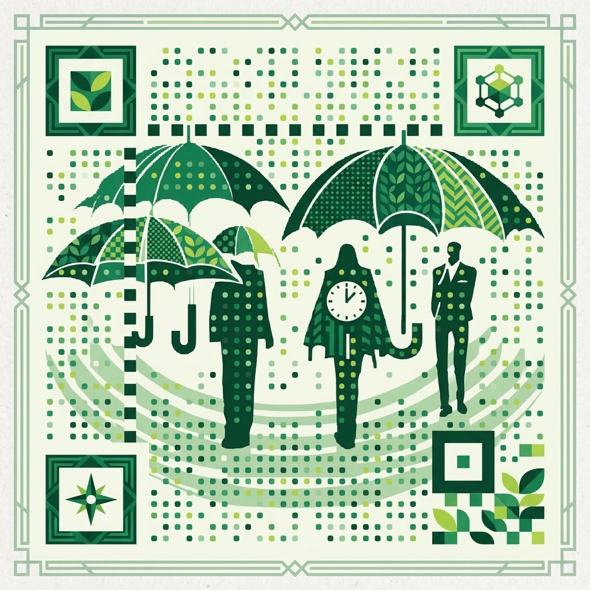
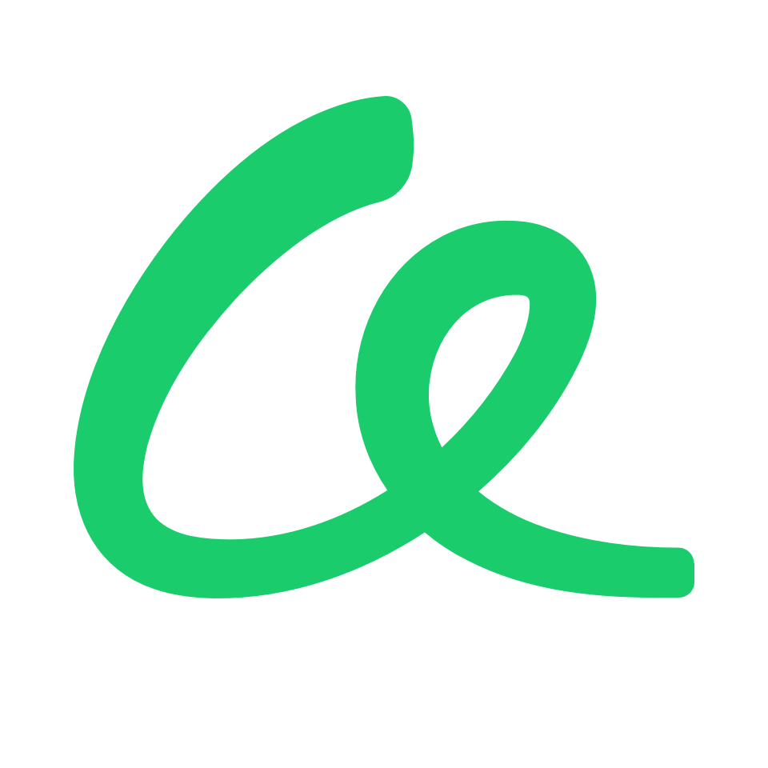

# 𐃉⚸👁️♀︎👁️☿𐃉 qArt-code

> A customized, client-side QR Code Studio built specifically for **Artizens** to elevate, brand, and promote their projects with ease[cite: 1].

---

## 🌟 Designed for Artizens

**qArt-code** is built to give creators and innovators an effortless way to share their work. Whether you are driving traffic to a crowd-funding campaign, an art installation, or a decentralized application, qArt-code helps you design high-impact, scannable QR codes in seconds.

---

## ✨ Features & Capabilities

- **Default & Custom Branding:** Pre-loaded with the **dWeb Artizen** logo, with full support to upload your own custom logos or artwork[cite: 1].
- **Granular Visual Styling:**
  - **Body Modules:** Custom dot patterns including *Extra Rounded*, *Dots*, *Rounded*, *Classy*, and *Square*[cite: 1].
  - **Eye & Corner Customization:** Independent shapes and colors for outer frames and inner eye modules[cite: 1].
- **Built-In Guardrails:**
  - **Color Contrast Checker:** Instant warnings to ensure your custom color schemes pass scannability standards across mobile cameras[cite: 1].
  - **Payload Density Alerts:** Real-time feedback when your destination link approaches density limits to keep your codes quick to scan[cite: 1].
- **Export Ready:** High-resolution downloads in **PNG** (for web, social media, and digital shares) or **SVG** (for stickers, posters, merch, and physical prints)[cite: 1].

---

## 🚀 How to Use

1. **Launch the Studio:** Head over to the [qArt-code App](https://thejollylama.github.io/qArt-code/) in your web browser[cite: 1].
2. **Set Your Target URL:** Enter the web address or link for your Artizen project or campaign[cite: 1].
3. **Customize Your Design:**
   - Choose your preferred body pattern and eye styles[cite: 1].
   - Select custom colors for the modules, background, and eyes[cite: 1].
   - Keep the default Artizen logo or upload your own image[cite: 1].
4. **Check Contrast & Density:** Ensure the real-time contrast indicator shows a safe reading score for camera scanning[cite: 1].
5. **Download & Share:** Click to export your completed QR code as a **PNG** or **SVG** and start promoting your project[cite: 1]!
